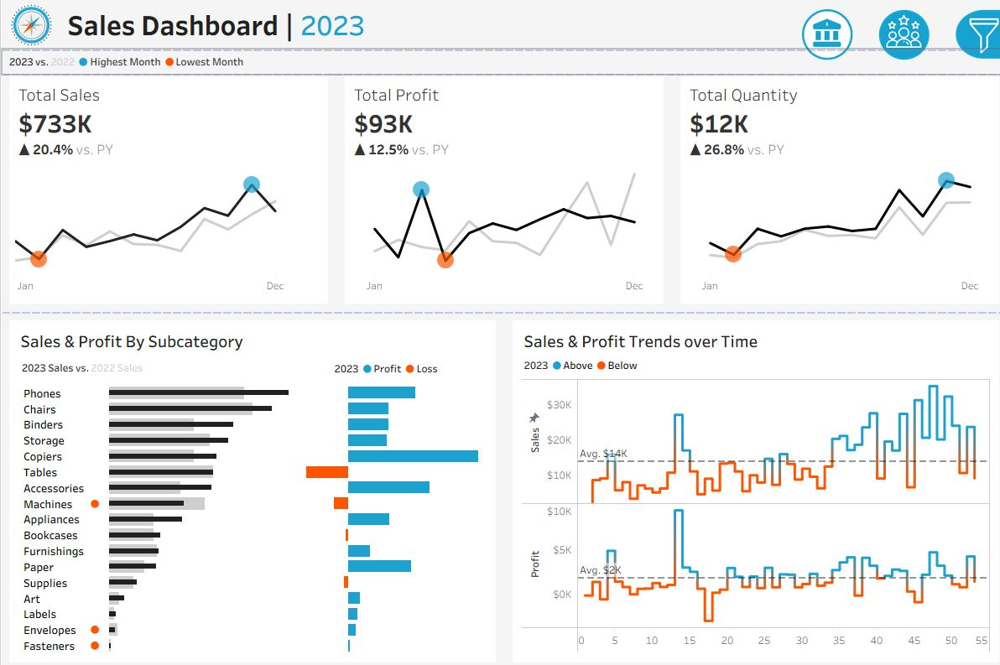

# 📊 Sales Dashboard | 2023

This repository contains an interactive Tableau dashboard that visualizes key sales metrics and performance insights for the year 2023.  
It provides a comprehensive view of sales trends, profitability, and category-level performance to help business users monitor growth and identify improvement opportunities.

---

## 🚀 Overview

The **Sales Dashboard** is designed to track and compare yearly performance across critical KPIs such as:

- **Total Sales** – $733K (+20.4% YoY)
- **Total Profit** – $93K (+12.5% YoY)
- **Total Quantity Sold** – 12K units (+26.8% YoY)

Each KPI includes historical trends to show month-by-month growth compared to the previous year.

---

## 📈 Dashboard Features

- **KPI Highlights:**  
  Top-level metrics for Sales, Profit, and Quantity with YoY percentage changes.
  
- **Sales & Profit by Subcategory:**  
  Horizontal bar chart showing 2023 vs 2022 performance for each product subcategory (Phones, Chairs, Binders, etc.).

- **Sales & Profit Trends Over Time:**  
  Dual-line charts visualizing monthly sales and profit trends, including average benchmark lines for quick performance comparison.

- **Visual Cues:**  
  - 🔵 **Blue markers** for highest-performing months or categories  
  - 🟠 **Orange markers** for lowest-performing months or losses  

---

## 🧠 Insights

- Consistent growth in total sales and profit compared to last year.  
- Notable performance improvements in high-volume categories like **Phones** and **Chairs**.  
- Fluctuating monthly profit patterns suggest possible seasonality or promotional impacts.  
- Loss indicators in certain subcategories (e.g., Accessories, Fasteners) highlight optimization opportunities.

---

## 🛠️ Tools & Technologies

- **Tableau Public** (Visualization)
- **Excel / CSV** (Data Source)
- **Data Wrangling:** Tableau Data Extracts (TDE/Hyper)
- **Version:** Tableau Public Desktop Edition

---

## 📷 Dashboard Preview

> *Image: 2023 Sales Dashboard showing KPI metrics, subcategory comparison, and sales/profit trends.*

---

